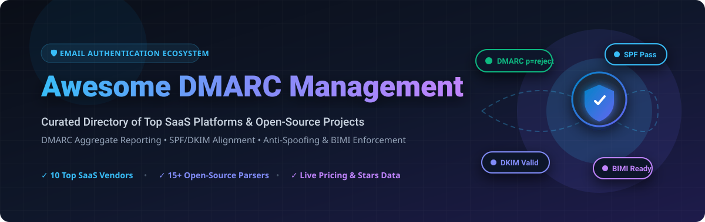

# Awesome DMARC Management 🛡️✉️

<a href="https://github.com/ishandutta2007/Awesome-Awesome-Awesome"></a><a href="https://discord.gg/jc4xtF58Ve"></a> [](https://github.com/ishandutta2007/Awesome-Awesome-Awesome) [](https://datatracker.ietf.org/doc/html/rfc7489) [](LICENSE) [](https://github.com/ishandutta2007/Awesome-Dmarc-Management/pulls) <a href="https://github.com/ishandutta2007"></a>



> **Curated directory of top commercial SaaS platforms and open-source GitHub projects for DMARC aggregate/forensic report parsing, SPF & DKIM monitoring, email anti-spoofing enforcement, and BIMI readiness.** 🚀

DMARC (**Domain-based Message Authentication, Reporting, and Conformance** - [RFC 7489](https://datatracker.ietf.org/doc/html/rfc7489)) protects email domains against spoofing, phishing, and impersonation attacks. This repository provides a comprehensive market landscape of commercial DMARC management platforms and open-source self-hosted parsers. 🔒

---

## 📋 Table of Contents

- [🏢 SaaS & Hosted Platforms](#-saas--hosted-platforms)
- [🔓 Open-Source GitHub Projects](#-open-source-github-projects)
- [🏗️ Architecture & Implementation Guide](#-architecture--implementation-guide)
- [🤝 How to Contribute](#-how-to-contribute)
- [⚠️ Disclaimer](#-disclaimer)
- [💖 Support & Sponsoring](#-support--sponsoring)
- [📈 Star History](#-star-history)

---

## 🏢 SaaS & Hosted Platforms 📊

> **💡 Market Intelligence**: The global DMARC and Email Authentication Security market is estimated at **$1.4 Billion (2026)** growing at a **~16.5% CAGR**, and is **moderately fragmented** with major enterprise cybersecurity suites holding top market share while specialized pure-play DMARC vendors capture domain-level enforcement adoption. 📈

The table below lists leading commercial SaaS DMARC platforms sorted by **Company Size (Revenue / Valuation) in descending order**: 🔝

| Product / Platform 🌐 | Starting Paid Tier 💳 | Free Tier / Trial Limit 🎁 | Company Size (Revenue / Valuation) 💰 | Key Focus & Capabilities 🎯 |
| :--- | :--- | :--- | :--- | :--- |
| **[Proofpoint Email Fraud Defense](https://www.proofpoint.com/us/products/email-protection/email-fraud-defense)** | $10,000 / year *(Enterprise suite minimum)* | 30-day enterprise proof-of-concept (POC) trial | **$12.3 Billion Valuation** *(Acquired by Thoma Bravo; ~$1.5B+ ARR)* | Enterprise-grade email fraud defense, automated DMARC enforcement, supplier threat risk management, and identity protection. |
| **[Mimecast DMARC Analyzer](https://www.mimecast.com/products/dmarc-analyzer/)** | $1,200 / year *($100/mo billed annually)* | 30-day free trial *(up to 5 domains monitored)* | **$5.8 Billion Valuation** *(Acquired by Permira; ~$650M+ ARR)* | Self-service & managed DMARC analyzer integrated into Mimecast’s enterprise email security ecosystem with DNS wizard. |
| **[Valimail](https://www.valimail.com/)** | $5,000 / year *(Enforce starter tier)* | **Free Forever** *(Valimail Align for M365 & Google Workspace)* | **$300 Million+ Valuation** *(Acquired by DigiCert in Sept 2025; $88M+ raised)* | Zero-touch automated DMARC enforcement platform leveraging continuous SPF/DKIM alignment and instant BIMI management. |
| **[Red Sift OnDMARC](https://redsift.com/ondmarc)** | $35 / month *(Essential plan)* | 14-day free trial *(Full platform access, no credit card required)* | **~$170 Million Valuation** *(£130M+ post-Series B; ~$19.2M ARR)* | AI-driven DMARC enforcement, dynamic SPF (DNS Guardian), automated BIMI management, and forensic report filtering. |
| **[EasyDMARC](https://easydmarc.com/)** | $35.99 / month *(Plus plan, billed annually)* | **Free Plan Forever** *(1 domain, 1,000 DMARC emails/mo, 14-day history)* | **~$100 Million Valuation** *($22.3M funding incl. $20M Series A in Sept 2024; ~$8.9M ARR)* | End-to-end email security platform with hosted SPF, hosted DKIM, AI-powered phishing defense, and MSP multi-tenant portal. |
| **[dmarcian](https://dmarcian.com/)** | $24 / month *(Basic plan, billed annually)* | **Free Personal Plan** *(1,250 messages/mo) & 30-day free trial* | **~$30 Million - $50 Million Valuation** *(Bootstrapped & profitable; founded by DMARC co-author)* | Deep technical DMARC report parsing, vendor classification engine, guided enforcement roadmaps, and enterprise consultancy. |
| **[Sendmarc](https://sendmarc.com/)** | $29 / month *(Premium plan)* | 21-day free trial *(1 domain, 5,000 emails/mo limit)* | **~$30 Million Valuation** *($8.5M Series A funding; ~$9.5M ARR)* | Managed DMARC platform designed for MSPs and enterprises to block email spoofing, monitor SPF/DKIM, and achieve `p=reject`. |
| **[PowerDMARC](https://powerdmarc.com/)** | $8 / month *(Basic plan, billed annually)* | **Free Plan Forever** *(1 domain, 10,000 emails/mo, 10-day history)* | **~$15 Million Valuation** *(Privately held; ~$4.1M ARR)* | Full-suite authentication platform featuring hosted SPF, hosted BIMI, MTA-STS, TLS-RPT, and threat intelligence mapping. |
| **[DMARC Advisor](https://dmarcadvisor.com/)** | €20 / month *(~$22/mo)* | 14-day free trial *(Full DMARC Manager platform access)* | **~$10 Million Valuation** *(Privately held; ~$2M-$4M ARR)* | European DMARC specialist platform delivering privacy-compliant report aggregation, domain grouping, and compliance scoring. |
| **[URIports](https://www.uriports.com/dmarc)** | $1.25 / month *(Sand plan: 3 domains, 10k reports/mo)* | 30-day free trial *(Full access, no credit card required)* | **~$3 Million Valuation** *(Bootstrapped indie SaaS; ~$500K-$1M ARR)* | Privacy-focused lightweight reporting service processing DMARC RUA/RUF, Network Error Logging (NEL), CSP, and TLS-RPT. |

---

## 🔓 Open-Source GitHub Projects ⚡

Below is a curated list of open-source DMARC report parsers, DNS validators, and email authentication tools sorted by **GitHub Star Count (descending)**: ⭐

| Repository 📦 | GitHub Stars ⭐ | Language / Tech Stack 💻 | Project Description & Capabilities 🛠️ |
| :--- | :--- | :--- | :--- |
| **[chenjj/espoofer](https://github.com/chenjj/espoofer)** | [](https://github.com/chenjj/espoofer/stargazers) | Python 🐍 | Testing tool designed to evaluate email spoofing vulnerabilities and bypass mechanisms in SPF, DKIM, and DMARC implementations. |
| **[domainaware/parsedmarc](https://github.com/domainaware/parsedmarc)** | [](https://github.com/domainaware/parsedmarc/stargazers) | Python / CLI 🐍 | De facto open-source DMARC report parser. Ingests aggregate (RUA) and forensic (RUF) reports via IMAP, Gmail API, MS Graph API, or directory files, exporting data to Elasticsearch, OpenSearch, Splunk, or PostgreSQL. |
| **[nicanorflavier/spf-dkim-dmarc-simplified](https://github.com/nicanorflavier/spf-dkim-dmarc-simplified)** | [](https://github.com/nicanorflavier/spf-dkim-dmarc-simplified/stargazers) | Markdown / Guide 📘 | Comprehensive interactive guide detailing SPF, DKIM, and DMARC protocol mechanics, alignment logic, and deployment troubleshooting. |
| **[debricked/dmarc-visualizer](https://github.com/debricked/dmarc-visualizer)** | [](https://github.com/debricked/dmarc-visualizer/stargazers) | Python / Vue.js 🟢 | Open-source dashboard to analyze and visualize DMARC aggregate report XML files using self-hosted infrastructure. |
| **[MattKeeley/Spoofy](https://github.com/MattKeeley/Spoofy)** | [](https://github.com/MattKeeley/Spoofy/stargazers) | Python 🐍 | Cybersecurity tool that inspects list of target domains to identify email spoofability based on SPF lookup limits and DMARC policy strength. |
| **[cry-inc/dmarc-report-viewer](https://github.com/cry-inc/dmarc-report-viewer)** | [](https://github.com/cry-inc/dmarc-report-viewer/stargazers) | PHP / JS 🐘 | Lightweight standalone DMARC aggregate and SMTP TLS-RPT report viewer featuring built-in IMAP email ingestion. |
| **[gutmensch/docker-dmarc-report](https://github.com/gutmensch/docker-dmarc-report)** | [](https://github.com/gutmensch/docker-dmarc-report/stargazers) | Docker / Shell 🐳 | Pre-packaged Docker compose stack running `dmarcts-report-parser` alongside MySQL and a web visualizer for one-click self-hosting. |
| **[v4d1/SpoofThatMail](https://github.com/v4d1/SpoofThatMail)** | [](https://github.com/v4d1/SpoofThatMail/stargazers) | Bash 🐚 | Automated shell script assessing domain susceptibility to email spoofing by auditing public DMARC and SPF DNS records. |
| **[domainaware/checkdmarc](https://github.com/domainaware/checkdmarc)** | [](https://github.com/domainaware/checkdmarc/stargazers) | Python / Library 🐍 | Python module and CLI for parsing and validating SPF and DMARC DNS records. Checks for syntax errors, DNS lookup limits (10-lookup SPF limit), and weak policies. |
| **[liuch/dmarc-srg](https://github.com/liuch/dmarc-srg)** | [](https://github.com/liuch/dmarc-srg/stargazers) | PHP 🐘 | Web-based DMARC summary report generator and XML log parser designed for lightweight web servers. |
| **[tierpod/dmarc-report-converter](https://github.com/tierpod/dmarc-report-converter)** | [](https://github.com/tierpod/dmarc-report-converter/stargazers) | Go 🐹 | Command-line utility to convert XML DMARC aggregate reports into human-readable CSV, HTML, or JSON formats. |
| **[userjack6880/Open-DMARC-Analyzer](https://github.com/userjack6880/Open-DMARC-Analyzer)** | [](https://github.com/userjack6880/Open-DMARC-Analyzer/stargazers) | PHP / MySQL 🐘 | Open-source web UI frontend for analyzing DMARC database tables populated by `dmarcts-report-parser` or `rrdmarc`. |
| **[truespar/sentio](https://github.com/truespar/sentio)** | [](https://github.com/truespar/sentio/stargazers) | Rust 🦀 | Multi-tenant mail server engine written in Rust featuring built-in DKIM/SPF/DMARC verification, ARC processing, and webhook delivery. |
| **[techsneeze/dmarcts-report-parser](https://github.com/techsneeze/dmarcts-report-parser)** | [](https://github.com/techsneeze/dmarcts-report-parser/stargazers) | Perl 🐪 | Popular Perl script that fetches DMARC RUA reports via IMAP or local disk, extracts XML attachments, and writes record entries into MySQL or PostgreSQL databases. |
| **[emersion/go-msgauth](https://github.com/emersion/go-msgauth)** | [](https://github.com/emersion/go-msgauth/stargazers) | Go 🐹 | High-performance Go library and command-line tools for parsing and verifying DKIM signatures, DMARC evaluation, and Authentication-Results headers. |
| **[CERT-Polska/mailgoose](https://github.com/CERT-Polska/mailgoose)** | [](https://github.com/CERT-Polska/mailgoose/stargazers) | Python 🐍 | Web security auditor built by CERT Polska to inspect email security posture, verifying SPF, DKIM, and DMARC record syntax and alignment. |
| **[dmarcguardhq/parse-dmarc](https://github.com/dmarcguardhq/parse-dmarc)** | [](https://github.com/dmarcguardhq/parse-dmarc/stargazers) | Go 🐹 | Single-binary DMARC aggregate report parser with embedded SQLite storage, web dashboard, IMAP intake, and Prometheus metrics exporter. |
| **[techsneeze/dmarcts-report-viewer](https://github.com/techsneeze/dmarcts-report-viewer)** | [](https://github.com/techsneeze/dmarcts-report-viewer/stargazers) | PHP 🐘 | Web interface intended for browsing DMARC aggregate report statistics stored in relational databases by `dmarcts-report-parser`. |
| **[globalcyberalliance/domain-security-scanner](https://github.com/globalcyberalliance/domain-security-scanner)** | [](https://github.com/globalcyberalliance/domain-security-scanner/stargazers) | JavaScript / Node 🟨 | Security auditing scanner that scans target domain lists and outputs actionable guidance for BIMI, DKIM, DMARC, and SPF deployment. |

---

## 🏗️ Architecture & Implementation Guide 🗺️

When choosing between a self-hosted open-source DMARC pipeline and a commercial SaaS platform, consider the operational tradeoffs:

```
[ Incoming Emails & Spoofing ]
              │
              ▼
   ┌──────────────────────┐
   │ Inbound Mail Gateway │ (Verifies SPF & DKIM signatures)
   └──────────┬───────────┘
              │
              ▼
   ┌──────────────────────┐
   │ DMARC Record Check   │ (Evaluates p=none / p=quarantine / p=reject)
   └──────────┬───────────┘
              │
              ├──► Generates Aggregate (RUA) & Forensic (RUF) Reports
              │
              ▼
 ┌─────────────────────────────────────────────────────────────┐
 │                   DMARC Report Ingestion                    │
 ├──────────────────────────────┬──────────────────────────────┤
 │  Open-Source Pipeline        │  Commercial SaaS Platform    │
 │                              │                              │
 │  Mailbox (IMAP / Graph)      │  Managed RUA Email Target    │
 │       │                      │       │                      │
 │       ▼                      │       ▼                      │
 │  parsedmarc / Perl parser    │  Auto Source Identification  │
 │       │                      │       │                      │
 │       ▼                      │       ▼                      │
 │  Elasticsearch / Postgres    │  Turnkey Guided Enforcement  │
 │       │                      │       │                      │
 │       ▼                      │       ▼                      │
 │  Kibana / Grafana / Web UI   │  Dynamic SPF & Hosted BIMI   │
 └──────────────────────────────┴──────────────────────────────┘
```

---

## 🤝 How to Contribute 🛠️

Contributions are welcome! If you know of an awesome DMARC management tool, report parser, or DNS validator that is missing:

1. **Fork** the repository. 🍴
2. Add your entry to either the **SaaS** or **Open-Source** table following the established column schema and sorting rules. 📝
3. For open-source tools, include the standard GitHub star badge:  
   `[](https://github.com/username/reponame/stargazers)`
4. Open a **Pull Request** with a brief summary of the added software. 🚀

---

## ⚠️ Disclaimer 📜

- This repository is a community-curated collection intended for educational and analytical purposes.
- **Enforcement Warning**: Transitioning your DMARC policy directly from `p=none` to `p=reject` without thoroughly auditing aggregate reports (RUA) may block legitimate transactional or third-party emails. Always ensure full SPF and DKIM alignment across all authorized email senders before setting enforcement rules.

---

## 💖 Support & Sponsoring ☕

Thank you for using and exploring **Awesome DMARC Management**! 🌟

If you found this repository helpful:
- ⭐ **Star this repository** to help others discover it!
- 🔄 **Fork & Share** it with fellow email security engineers and system administrators.
- ☕ **Buy me a coffee / Sponsor**: If you'd like to support ongoing open-source curation and development, consider sponsoring via [GitHub Sponsors](https://github.com/sponsors/ishandutta2007).

---

## 📈 Star History

[](https://star-history.dera.page/#ishandutta2007/Awesome-Dmarc-Management&type=date&legend=top-left)
